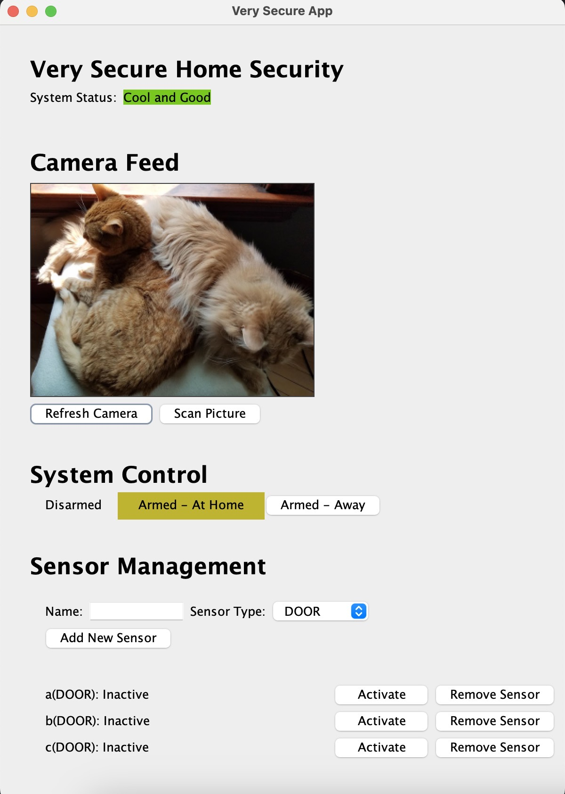

# Java-UdaSecurity


****

This is a home security application that tracks the status of sensors, monitors camera feeds, and adjusts the system’s alarm status based on the inputs. 
Users can arm and disarm the system whether they are at home or away

## Introduce

This program is a simple security detection application written in Java. It simulates a security detection system where an alarm is triggered after a sensor is activated twice, 
or if a cat is detected, an alarm will also go off.

## Directory Structure


### 1. Application

    It is mainly for building a panel.

### 2. Image
    The Image module is primarily used to recognize images, using the AWS Image Recognition API.

### 3. Security

    The security service primarily provides the logic for security processing.


## Quickstart

 ### Build environment
    0. Install Java (version 15 or higher)
    1. Install maven (version 3.6.0 or higher)


### Start main

```java
 package com.udacity.application;

    public class CatpointApp {
        @Inject
        private CatpointGui gui;
        public void run(){
            Guice.createInjector(new SecurityModule(), new ImageModule(Constants.AWS_CONTROL),new PanelModule()).injectMembers(this);
            gui.builder();
            gui.setVisible(true);
        }
        public static void main(String[] args) {
            new CatpointApp().run();
        }
    }
```


